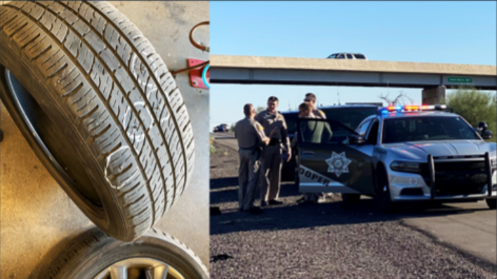

# Defining Stingers

**Spike Strips** are a tool used to limit or interrupt movement of a target vehicle by rendering the vehicle's tires useless.

* Spike strips utilize metal spikes to puncture rubber tires and allow air to escape, flattening them. The vehicle will lose traction at speeds and if driven on for long, the vehicles rim combined with the weight will destroy the rubber and cause the vehicle to ride solely on the rim.
* Under certain circumstances, use of spike strips can be considered lethal force and officers should take special care to ensure their placement wouldn’t cause undue danger to the public at large or bring about unnecessary death.

<figure><figcaption></figcaption></figure>
